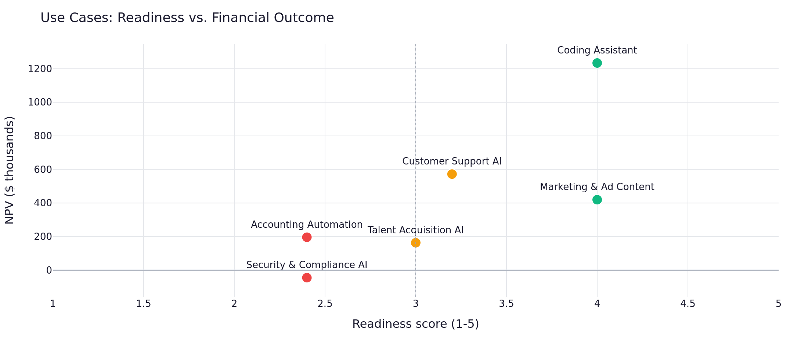
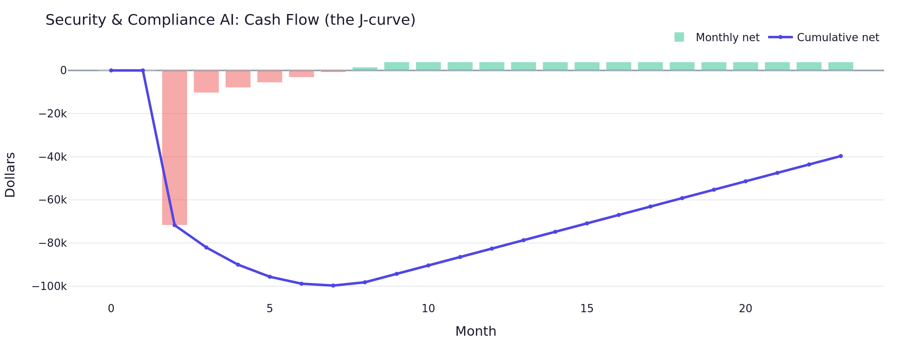
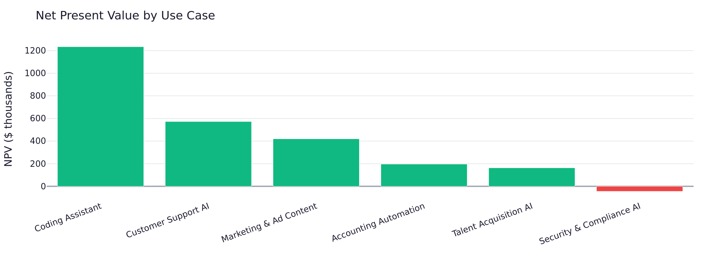
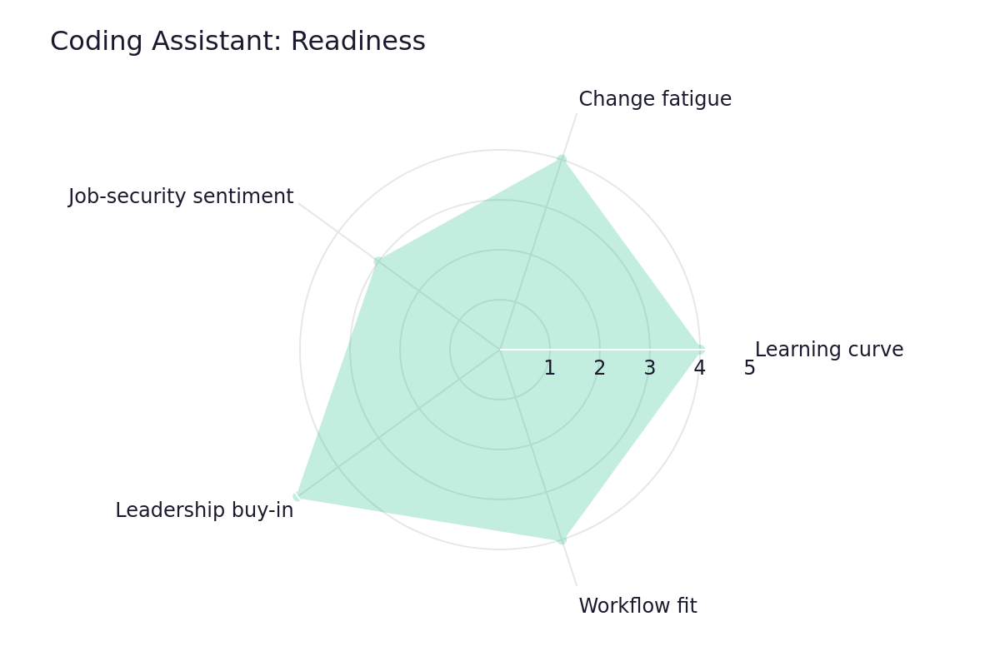

# AI Adoption ROI Model

A decision-support tool that helps a company answer a question almost every business is asking right now:

> *We've adopted AI across the company — is it actually paying off?*

It models the real costs and benefits of each AI use case (coding assistants, customer support, marketing, and more), shows the financial return, and — importantly — keeps the squishy human factors (learning curve, change fatigue, job-security anxiety) as a separate, honest readiness check rather than pretending they're precise dollar figures.

**🔗 Live demo: [your-app-name.streamlit.app](https://your-app-name.streamlit.app)** — try it in your browser, no install needed.

> *Replace the link above with your actual Streamlit URL once deployed. (On the free tier, the app may take ~30 seconds to wake up if it hasn't been used recently.)*



*The signature view: every AI use case plotted by its financial return against how well the organization is actually absorbing it. Top-right = healthy bets. Bottom-left = the ones in trouble. The use case that looks fine financially but sits low on readiness is exactly the kind of risk a spreadsheet would miss.*

---

## Why this tool is different

Most AI ROI analyses fall into one of two traps. This tool is built to avoid both.

**Trap 1: Only counting the easy numbers.** It's simple to tally token costs and license fees. It's harder — but more honest — to also account for setup time, training, the productivity dip while people learn, and the fact that benefits *ramp up* slowly rather than appearing overnight. This tool models all of that, including the realistic "J-curve" where money goes out first and benefits catch up later.

**Trap 2: Faking precision on the human factors.** Plenty of models quietly turn "people are anxious about their jobs" into a made-up dollar figure, hiding a guess inside a number that looks exact. This tool refuses to do that. The human factors live in a **separate readiness scorecard**, rated on intuitive scales, and sit *alongside* the financials as a "how much should we trust this result?" lens.

There's an optional bridge between the two: a low readiness score can *suggest* discounting the projected benefits (because a poorly-adopted tool delivers less than its sticker value) — but the user always sees and controls that adjustment. The judgment never hides in the code.

---

## What it does

- **Models each AI use case separately** — costs, benefits, timing, and ramp-up — because a coding assistant and a compliance tool have completely different economics.
- **Calculates the metrics that matter:** ROI, payback period, and NPV (net present value), over a 1-3 year horizon.
- **Shows the J-curve** — the month-by-month cash flow, so you can see the early cost hump and when each use case turns the corner.
- **Rolls everything up to the company level**, with a per-use-case verdict so winners and laggards are visible side by side.
- **Keeps a readiness scorecard** for the human factors, shown as an at-a-glance radar chart, never converted to dollars.
- **Optionally bridges the two** — let a low readiness score discount the benefits, with the adjustment fully visible and user-controlled.
- **Everything is editable** — start from the realistic sample company and overwrite any figure with your own.

---

## See it in action

The interactive app has two views you toggle between:

- **Use Case** — deep-dive one use case: edit its costs and benefits, set its readiness scores, and see its financials, J-curve, and a combined verdict that ties the money and the human side together.
- **Company (consolidated)** — the whole AI program combined, with the per-use-case verdict table and the readiness-vs-financial map shown above.

### The J-curve: costs first, benefits later



*Each use case's cash flow. The deep early dip is the upfront investment; the slow climb is benefits ramping up. Where the line crosses zero is the payback point — and some use cases never get there within the horizon.*

### Which use cases are paying off



*A clear ranking of where the AI program is creating value — and where it's destroying it.*

### The readiness scorecard (the human side)



*The organizational health of each use case across five factors — kept deliberately separate from the dollar figures.*

---

## How it works, in plain terms

The model doesn't guess at a single ROI number. It builds the cash flow month by month:

- **Costs** hit immediately — you pay for licenses and tokens from day one.
- **Benefits** ramp up gradually, because value takes time to materialize as people learn the tool.
- **One-time costs** (setup, integration, initial training) land upfront.

That asymmetry — paying first, benefiting later — is what creates the J-curve. From the monthly cash flow, the tool computes:

| Metric | What it tells you |
|---|---|
| **ROI** | Total return relative to total cost over the horizon |
| **Payback period** | The month the investment breaks even |
| **NPV** | The value in today's dollars, accounting for the fact that future money is worth less (using an adjustable discount rate) |

The **readiness scorecard** rates five human factors (learning curve, change fatigue, job-security sentiment, leadership buy-in, workflow fit) on 1-5 scales with plain-language labels. These stay separate from the dollars — but can optionally suggest a "realization" discount on the benefits, which the user reviews and controls.

> **Note on the data:** The tool ships with a realistic *simulated* company of six AI use cases — a couple of clear winners, a couple still ramping, and one that's underwater. The numbers are illustrative, but the structure and the modeling reflect how this analysis is actually done. Every input is editable, so a real user can plug in their own figures.

---

## Project structure

```
ai-roi-model/
├── README.md                    ← you are here
├── requirements.txt             ← the libraries needed to run it
├── .streamlit/
│   └── config.toml              ← app theme
├── data/
│   └── sample_company.json      ← the sample company (6 use cases)
├── src/
│   ├── sample_data.py           ← builds the sample data & defines the model
│   └── engine.py                ← the financial engine (ROI, payback, NPV)
└── app/
    └── streamlit_app.py         ← the interactive app
```

---

## Running it yourself (technical setup)

**1. Install the requirements** (one time):

```bash
pip install -r requirements.txt
```

**2. (Optional) Regenerate the sample data:**

```bash
python src/sample_data.py
```

**3. Launch the app:**

```bash
streamlit run app/streamlit_app.py
```

This opens the tool in your web browser.

---

## Tools used

Python, pandas (calculations), Plotly (the interactive charts), and Streamlit (the app). The app is deployed for free on Streamlit Community Cloud, which runs it directly from this GitHub repository.

---

## A note on scope

This is a portfolio project built to demonstrate end-to-end thinking on a genuinely hard, current business problem: separating what AI adoption *costs* from what it's *worth*, while being honest about the parts that can't be cleanly measured. The data is simulated, but the financial methods (NPV, payback, ramp modeling) and the two-tier treatment of hard and soft factors reflect how a real strategy or FP&A team would approach it.
